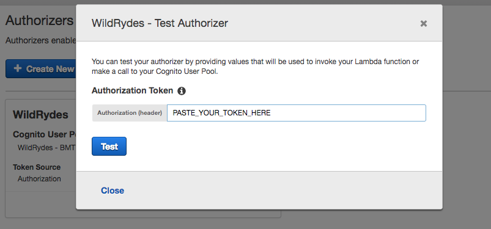

# Module 4: RESTful APIs with AWS Lambda and Amazon API Gateway

In this module you'll use API Gateway to expose the Lambda function you built in the [previous module][serverless-backend] as a RESTful API. This API will be accessible on the public Internet. It will be secured using the Amazon Cognito user pool you created in the [User Management][user-management] module. Using this configuration you will then turn your statically hosted website into a dynamic web application by adding client-side JavaScript that makes AJAX calls to the exposed APIs.


The diagram above shows how the API Gateway component you will build in this module integrates with the existing components you built previously. The grayed out items are pieces you have already implemented in previous steps.

The static website you deployed in the first module already has a page configured to interact with the API you'll build in this module. The page at /ride.html has a simple map-based interface for requesting a unicorn ride. After authenticating using the /signin.html page, your users will be able to select their pickup location by clicking a point on the map and then requesting a ride by choosing the "Request Unicorn" button in the upper right corner.

This module will focus on the steps required to build the cloud components of the API, but if you're interested in how the browser code works that calls this API, you can inspect the [ride.js](../1_StaticWebHosting/website/js/ride.js) file of the website. In this case the application uses jQuery's [ajax()](https://api.jquery.com/jQuery.ajax/) method to make the remote request.


## Implementation Instructions

The primary focus here is learning how to use the serverless framework to provision the necessary services for our backend application. 

You may notice that some reference materials are from the official Cloudformation and others from Serverless. That is because for various things, there is a 1:1 overlap in syntax that Serverless relies on Cloudformation for documentation  (i.e. specifying <b>resources:</b>).  

If you wish to know more, visit the <a target="_blank" href="https://serverless.com/framework/docs/">serverless website</a>. You will notice that there are adaptations for Azure, Google Cloud, AWS and so forth. Since we are using AWS, you should look there.  

### 1. Setup

:heavy_exclamation_mark: Ensure you've completed the [setup][../3_ServerlessBackend] from the previous module before beginning this module.

### 2. Create a New REST API

As before, there is a serverless yml file that is readily available for use in this directory. Otherwise, you continue working with your version from the previous module.

Its time to expose our Lambda function in the form of a Restful API endpoint. To help you get started, you should copy and paste the <b>events</b> stanza in the serverless.yml file so it looks similar to below. 

```YAML
functions:
  RidesHandler:
    handler: requestUnicorn.handler
    events:
      - ? 
``` 

What you need to do now is specify a lambda-proxy integration that is contactable via a "post" to the endpoint "ride". The serverless <a target="_blank" href="https://serverless.com/framework/docs/providers/aws/events/apigateway/">API Gateway documentation</a> should provide you more information on different ways you can achieve this.   

<h4>Enable CORS</h4>
Modern web browsers prevent HTTP requests from scripts on pages hosted on one domain to APIs hosted on another domain unless the API provides cross-origin resource sharing (CORS) response headers that explicitly allow them.  For this reason, we need to tell serverless to enable the cors option as well.  
<br>

Once you have filled in the missing fields, your yaml file should look quite similar to the below snippet.  

<details>
<summary><strong>See answers (expand for details)</strong></summary>

```YAML
functions:
  RidesHandler:
    handler: requestUnicorn.handler
    events:
      - http:
          path: ride
          method: post
          cors: true
``` 

</details>

<br>

Run `serverless deploy` in the CLI. 

That should provision a new API gateway resource and serverless should in turn print out the endpoint url. However attempting to POST to that url will result in a message returned "Authorization not configured". That brings us to the final step.  

<br>

### 3. Create a Cognito User Pools Authorizer

#### Background
Amazon API Gateway can use the JWT tokens returned by Cognito User Pools to authenticate API calls. In this step you'll configure an authorizer for your API to use the user pool you created in [User Management][user-management].

**:white_check_mark: Step-by-step directions**
1. Update the `serverless.yml` to set the Cognito User Pool we created in [User Management][user-management] as an authorizer to our <b>RidesHandler</b> lambda function. Below is a snippet that shows us how the <b>authorizer</b> stanza is written. You will need to find out what goes in it.  

    ```YAML
    functions:
    RidesHandler:
        handler: requestUnicorn.handler
        events:
        ...
        authorizer: ?
    ```  

    The best resources on setting this up can be found in the <a target="_blank" href="https://serverless.com/framework/docs/providers/aws/events/apigateway/#http-endpoints-with-custom-authorizers">http endpoint with custom authorizer documentation</a>, in our case its under the section: <i>"You can also configure an existing Cognito User Pool as the authorizer, as shown in the following example:"</i>.  

    <details><summary><strong>The handler function yaml should look similar to: (click to expand)</strong></summary>

    ```YAML
    functions:
    RidesHandler:
        handler: requestUnicorn.handler
        events:
        - http: 
            integration: lambda-proxy
            path: ride        
            method: post
            cors: true
            authorizer:
                name: request-ride-auth
                arn: arn:aws:cognito-idp:ap-southeast-2:XXXXXXXXX:userpool/ap-southeast-2_XXXXXXXXX
    ```

    </details>  


2. Deploy your updated API from the terminal: 

    ```serverless deploy```

#### Verify your authorizer configuration

**:white_check_mark: Step-by-step directions**
1. Open a new browser tab and visit `/ride.html` under your website's domain.
1. If you are redirected to the sign-in page, sign in with the user you created in the last module. You will be redirected back to `/ride.html`.
1. Copy the auth token from the notification on the `/ride.html`,
1. In the AWS Console, navigate to the [API Gateway Console][api-gw-console]
1. Select your API `dev-unicornservice`
1. Select `Authorizers` in the left hand navigation pane
1. Click **Test** at the bottom of the card for the authorizer.
1. Paste the auth token into the **Authorization Token** field in the popup dialog.
    

1. Click **Test** button and verify that the response code is 200 and that you see the claims for your user displayed.


### 4. Update Web App Configuration

Update the /js/config.js file in your website deployment to include the invoke URL of the stage you just created. You should copy the invoke URL directly from the top of the stage editor page on the Amazon API Gateway console and paste it into the \_config.api.invokeUrl key of your sites /js/config.js file. Make sure when you update the config file it still contains the updates you made in the previous module for your Cognito user pool.

**:white_check_mark: Step-by-step directions**
1. On your Cloud9 development environment open `js/config.js`
1. Update the **invokeUrl** setting under the **api** key in the config.js file. Set the value to the **Invoke URL** for the deployment stage your created in the previous section.
    An example of a complete `config.js` file is included below. Note, the actual values in your file will be different.
    ```JavaScript
    window._config = {
        cognito: {
            userPoolId: 'us-west-2_uXboG5pAb', // e.g. us-east-2_uXboG5pAb
            userPoolClientId: '25ddkmj4v6hfsfvruhpfi7n4hv', // e.g. 25ddkmj4v6hfsfvruhpfi7n4hv
            region: 'us-west-2' // e.g. us-east-2
        },
        api: {
            invokeUrl: 'https://rc7nyt4tql.execute-api.us-west-2.amazonaws.com/prod' // e.g. https://rc7nyt4tql.execute-api.us-west-2.amazonaws.com/prod,
        }
    };
    ```

1. Save the modified file making sure the filename is still `config.js`.
1. Commit the changes to your git repository:
    ```
    $ git add js/config.js 
    $ git commit -m "configure api invokeURL"
    $ git push
    ...
    Counting objects: 4, done.
    Compressing objects: 100% (4/4), done.
    Writing objects: 100% (4/4), 422 bytes | 422.00 KiB/s, done.
    Total 4 (delta 3), reused 0 (delta 0)
    To https://git-codecommit.us-east-1.amazonaws.com/v1/repos/wildrydes-site
       c15d5d5..09f1c9a  master -> master
    ```

    [Amplify Console][amplify-console-console] should pick up the changes and begin building and deploying your web application. Watch it to verify the completion of the deployment.

## Implementation Validation

**:white_check_mark: Step-by-step directions**
1. Visit `/ride.html` under your website domain.
1. If you are redirected to the sign in page, sign in with the user you created in the previous module.
1. After the map has loaded, click anywhere on the map to set a pickup location.
1. Choose **Request Unicorn**. You should see a notification in the right sidebar that a unicorn is on its way and then see a unicorn icon fly to your pickup location.

### :star: Recap

:key: [Amazon API Gateway][api-gw] is a fully managed service that makes it easy for developers to create, publish, maintain, monitor, and secure APIs at any scale. You can easily plug in Authorization via [Amazon Cognito][cognito] and backends such as [AWS Lambda][lambda] to create completely serverless APIs.

:wrench: In this module you've used API Gateway to provide a REST API to the Lambda function created in the previous module. From there you've updated the website to use the API endpoint so that you can request rides and the information about the ride is saved in the DynamoDB table created earlier.

:star: Congratulations, you have completed the Wild Rydes Web Application Workshop! Check out our [other workshops](../../README.md#workshops) covering additional serverless use cases.

### Next

:white_check_mark: In the [next module][oauth2], we shall use OAuth 2.0 flows to create a WildRydes a platform.

:white_check_mark: See this workshop's [cleanup guide][cleanup] for instructions on how to delete the resources you've created.


[amplify-console]: https://aws.amazon.com/amplify/console/
[amplify-console-console]: https://console.aws.amazon.com/amplify/home
[api-gw]: https://aws.amazon.com/api-gateway/
[api-gw-console]: https://console.aws.amazon.com/apigateway/home
[cleanup]: ../9_CleanUp/
[cognito-console]: https://console.aws.amazon.com/cognito/home
[cognito]: https://aws.amazon.com/cognito/
[configjs]: ../1_StaticWebHosting/website/js/config.js
[dynamodb-console]: https://console.aws.amazon.com/dynamodb/home
[dynamodb]: https://aws.amazon.com/dynamodb/
[iam-console]: https://console.aws.amazon.com/iam/home
[jwt-decoder]: https://jwt.io/
[lambda-console]: https://console.aws.amazon.com/lambda/home
[lambda]: https://aws.amazon.com/lambda/
[restful-apis]: ../4_RESTfulAPIs/
[serverless-backend]: ../3_ServerlessBackend/
[setup]: ../0_Setup/
[static-web-hosting]: ../1_StaticWebHosting/
[user-management]: ../2_UserManagement/
[oauth2]: ../5_OAuth