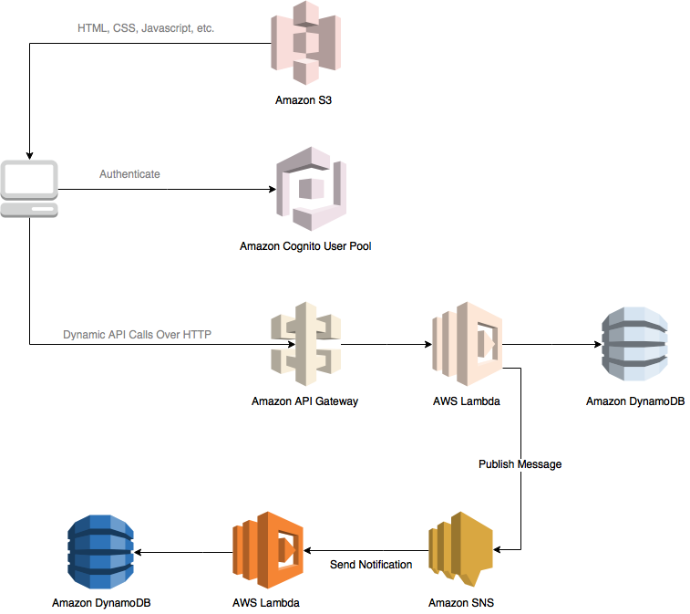

# Module 5: SNS Topic and Notifications To Lambda Functions



The diagram above shows how the SNS component you will build in this module integrates with the existing components you built previously. The grayed out items are pieces you have already implemented in previous steps.

This module will focus on integration of SNS to your current architecture. The existing NodeJS code "requestUnicorn.js" has been altered slightly to publish a message to an SNS topic.  

You may also notice that a new file "tallyUnicorn.js" has been introduced. This contains code for the new lambda function in which will be subscribed to an SNS topic in order to receive messages containing details on the dispatched unicorn. Once the message is received, it will proceed to update a separate DynamoDB table that keeps track of the number of times each unicorn has been dispatched so far. 

This module will also be a challenge as it will take your acquired knowledge from module 3 to provision 1 more Lambda function and DynamoDB table.

Lets Begin!   

## Implementation Instructions

The primary focus here is learning how to use the serverless framework to provision the necessary services for our backend application. 

You may notice that some reference materials are from the official Cloudformation and others from Serverless. That is because for various things, there is a 1:1 overlap in syntax that Serverless relies on Cloudformation for documentation  (i.e. specifying <b>resources:</b>).  

If you wish to know more, visit the <a target="_blank" href="https://serverless.com/framework/docs/">serverless website</a>. You will notice that there are adaptations for Azure, Google Cloud, AWS and so forth. Since we are using AWS, you should look there.  

<br>

### 1. Prerequisites

1. Install Node version 6.10 (https://nodejs.org/en/) if you have not done so yet.  
2. Run "npm install npm@latest -g" in CLI - updates to the latest NPM version 
3. Run "npm install -g serverless" in CLI - installs the serverless utility on your machine so it can be run in anywhere  
4. Choose a code editor (i.e. Atom, Visual Code etc) and open WebApplication/4_RESTfulAPIs project folder 

<br>

### 2. Create DynamoDB table

By now, you should already have the serverless.yml code to provision the DynamoDB table dedicated to recording the requested rides. We need 1 more table to store a counter of the number of times each unicorn gets dispatched. For simplicity, the unicorns will be uniquely identified by their name.  

You can see a simple example of constructing stanzas to provision a DynamoDB table <a href="https://serverless.com/framework/docs/providers/aws/guide/resources/">here</a>. To help you get started, you may copy and paste the snippet below the existing <b>RidesTable</b> logical grouping.  

```YAML
    UnicornsTable:
      Type: {RESOURCE_TYPE}
      Properties:
        TableName: {TABLE_NAME}
        AttributeDefinitions:
          -
            AttributeName: {ATTRIBUTE_NAME}
            AttributeType: S
        KeySchema:
          -
            AttributeName: {ATTRIBUTE_NAME}
            KeyType: HASH
        ProvisionedThroughput:
          ReadCapacityUnits: 1
          WriteCapacityUnits: 1
```  

As before, you need to figure out the few missing variables. For your reference, you can look <a target="_blank" href="https://serverless.com/framework/docs/providers/aws/guide/resources/#aws-cloudformation-resource-reference">here</a> to decide on the appropriate value for <b>RESOURCE_TYPE</b>. 

Secondly, look into tallyUnicorn.js to decide on the values for <b>TABLE_NAME</b> and <b>ATTRIBUTE_NAME</b>. Once you have filled in the blanks, you should have something that looks like below:  

<details>
<summary><strong>See answer (expand for details)</strong></summary>

```YAML
    UnicornsTable:
      Type: AWS::DynamoDB::Table
      Properties:
        TableName: Unicorns
        AttributeDefinitions:
          -
            AttributeName: Name
            AttributeType: S
        KeySchema:
          -
            AttributeName: Name
            KeyType: HASH
        ProvisionedThroughput:
          ReadCapacityUnits: 1
          WriteCapacityUnits: 1
```
</details>  

<br>

### 3. Create new Lambda and Subscribe to SNS Topic

The next task is hooking up a Lambda function to an SNS topic. One of the features with serverless is that you can specify to subscribe a Lambda function to a topic without having to worry about explicitly creating it. Serverless will handle that process for you.  

A good place to find exampels on how to specify Lambda subscriptions to SNS topics can be found <a target="_blank" href="https://serverless.com/framework/docs/providers/aws/events/sns/">here</a>.    

Lets start by adding in a snippet beneath the existing <b>RidesHandler</b> logical grouping. The handler function is in "tallyUnicorn.js". You should be able to acquire information on the value of <b>HANDLER_FUNCTION</b> by looking in there. The topic name can be one of your choosing.   

```YAML
  UnicornsHandler:
    handler: {HANDLER_FUNCTION}
    events:
      - sns: {TOPIC_NAME}
```

The topic name you have decided on will be important detail from here on as it you will need it to reference it in several parts of the yaml. 

<details>
<summary><strong>See answer (expand for details)</strong></summary>

```YAML
  UnicornsHandler:
    handler: tallyUnicorn.handler
    events:
      - sns: DispatchUnicorn
```
</details>  

<br>

### 4. Update Lambda policy to allow sending SNS notifications

If you look into <b>requestUnicorn.js</b> on line 76, you will see that we are attempting to use SNS to publish a message to a topic. 

The issue here is the role assumed by the Lambda functions contains insufficient permissions to invoke the SNS API method to publish messages to that topic.  

Lets remedy that by look back into the serverless.yml file at the stanza <b>iamRoleStatements</b>. For starters, you can copy and paste the snippet below the existing policy.  

```YAML
    - Effect: "Allow"
      Action:
        - "{SERVICE_NAMESPACE}:{API_METHOD}"
      Resource:
        Fn::Join:
          - ':'
          - - "arn:aws:sns"
            - Ref: "{AWS_REGION}"
            - Ref: "{AWS_ACCOUNT_ID}"
            - "{TOPIC_NAME}"
```  

We need to figure out a few variables here for our new policy. Recall that in any event you are unsure how to construct the policy above you can look into the online resources below: 

1. <a target="_blank" href="http://docs.aws.amazon.com/general/latest/gr/aws-arns-and-namespaces.html#genref-aws-service-namespaces">AWS Service namespaces</a> 

2. <a target="_blank" href="http://docs.aws.amazon.com/sns/latest/dg/AccessPolicyLanguage_SpecialInfo.html#sns_aspen_actions">SNS API methods</a>.  

Now we just need to specify the SNS topic Arn as the resource. If you are unfamiliar with the syntax above in the <b>Resources</b> section, what is happening here is we are performing a string join using AWS <a target="_blank" href="http://docs.aws.amazon.com/AWSCloudFormation/latest/UserGuide/intrinsic-function-reference.html">Cloudformation's intrinsic functions</a>.  

It is useful to remember that the SNS Arn is composed of various components as listed below in sequential order: 
1. The Amazon service namespace
2. AWS region
3. AWS account id
4. Topic name

With that said, we need to gain reference to the region and account id the topic will be provisioned in. We shall make use of Cloudformation's pseudo parameters to access those variables. The best online resources documenting pseudo parameters can be found <a target="_blank" href="http://docs.aws.amazon.com/AWSCloudFormation/latest/UserGuide/pseudo-parameter-reference.html">here</a>.  

We also want to find the appropriate value for <b>TOPIC_NAME</b>. If you look back to the prior section (3) where we created the Lambda that subscribes to a topic you should be able to retrieve the topic name.  

There are two arguments here as denoted by the first column of (-) characters. The first is the delimiter between each component which we specify it as a colon. The second is just a list of strings. Essentially this evaluates to a string that hypothetically looks like "arn:aws:sns:ap-southeast-1:66666666:SomeTopicName".  

Once completed, we should end up with something that looks similar to:

<details>
<summary><strong>See answer (expand for details)</strong></summary>

```YAML
    - Effect: "Allow"
      Action:
        - "sns:Publish"
      Resource:
        Fn::Join:
          - ':'
          - - "arn:aws:sns"
            - Ref: "AWS::REGION"
            - Ref: "AWS::ACCOUNT_ID"
            - "DispatchUnicorn"
``` 

</details>

<br>

### 5. Supply Topic Arn as an environment variable to Lambda

One important parameter we have yet to supply to the "requestUnicorn" Lambda is the topic arn. If you look at the function starting on line 80, you will notice that it is expecting a topic arn supplied as an environment variable.  

You can find helpful examples on passing environment variables to Lambda functions during deployment <a target="_blank" href="https://serverless.com/framework/docs/providers/aws/guide/functions/#environment-variables">here</a>.  

Now that we know the topic name, lets provide the environment variable like below. 

```YAML
  RidesHandler:
    handler: ...
    events:
      ...
    environment:
      {ENVIRONMENT_VAR_NAME}:
        Fn::Join:
          - ':'
          - - "arn:aws:sns"
            - Ref: "{AWS_REGION}"
            - Ref: "{AWS_ACCOUNT_ID}"
            - "{TOPIC_NAME}"
```

Go ahead and fill in the environment variable for starters based on what you observe in the JS code.  

Again, we are building the SNS Arn using Cloudformation's intrinsic function "Fn::Join". Using what you have learnt from the prior section, you should be able to also fill in the remaining blanks that compose the topic Arn. Your environment stanza should look something like the snippet below. 

<details>
<summary><strong>See answer (expand for details)</strong></summary>

```YAML
    environment:
      dispatchUnicornTopicArn:
        Fn::Join:
          - ':'
          - - "arn:aws:sns"
            - Ref: "AWS::Region"
            - Ref: "AWS::AccountId"
            - "DispatchUnicorn"
```  

</details>

<br>

### 6. Update IAM Policy for new Lambda function

There is one remaining task we have to complete here which is to add a new policy to <b>iamRoleStatements</b> so our Lambda can write to the new DynamoDB table. Don't forget that we can use the <a target="_blank" href="https://serverless.com/framework/docs/providers/aws/guide/functions/#permissions">function permissions documentation</a> as our reference point.  

If we look into "tallyUnicorn.js", the first function <b>updateDispatchedUnicornCount</b> invokes the DynamoDB service to increment a tally for the dispatched unicorn. We can update the policy by tacking on the new DynamoDB table Arn and the new API service to the existing stanza. So, we can start off by having something that looks like below: 

```YAML
  iamRoleStatements:
    - Effect: "Allow"
      Action:
        - "dynamodb:PutItem"
        - "dynamodb:{API_SERVICE}"
      Resource: 
        - "Fn::GetAtt": [RidesTable, Arn]
        - "Fn::GetAtt": [{TABLE_NAME}, Arn]
```

You will have to fill in the values of <b>API_SERVICE</b> and <b>TABLE_NAME</b> here.  

Remember that you can find the <b>API_SERVICE</b> in the <a target="_blank" href="http://docs.aws.amazon.com/amazondynamodb/latest/developerguide/api-permissions-reference.html">AWS documentation</a>.

To retrieve the logical table name, look back into the serverless.yml where you specified the new table.  

You should something that looks like below: 

```YAML
  iamRoleStatements:
    - Effect: "Allow"
      Action:
        - "dynamodb:PutItem"
        - "dynamodb:UpdateItem"
      Resource: 
        - "Fn::GetAtt": [RidesTable, Arn]
        - "Fn::GetAtt": [UnicornsTable, Arn]
```

<br>

### 7. Deploy and Testing the new functionality

We should now deploy what we have. Run "serverless deploy" in the CLI and wait until it completes.  

Now, its time to test to see if everything works as expected. What we can do here is navigate to the web application you created back in module 1, login and request a unicorn. Take note of its name as well.  

We can verify that stuff works by either: 
1. Log into the AWS console and look for the DynamoDB unicorns table. You should see an entry there for the unicorn and a DispatchCount field that has a value of 1 or however many times it has been dispatched.  

2. Use AWS CLI and run <b>"aws dynamodb get-item --table-name Unicorns --key '{"Name": {"S": "Shadowfax"}}'"</b>. You will then receive a JSON response that looks a bit like:
```JSON
{
    "Item": {
        "Name": {
            "S": "Shadowfax"
        }, 
        "DispatchCount": {
            "N": "1"
        }
    }
}
```
